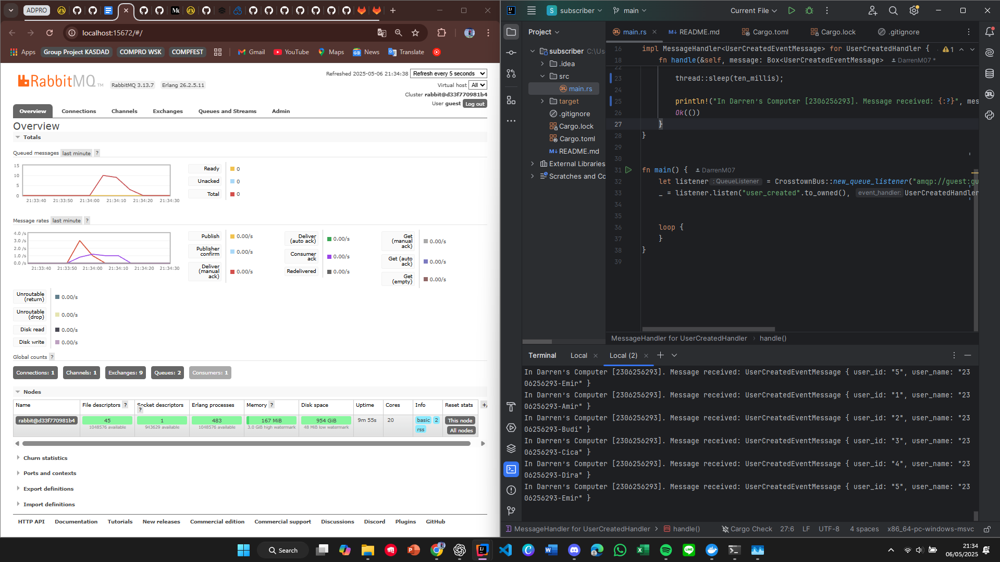
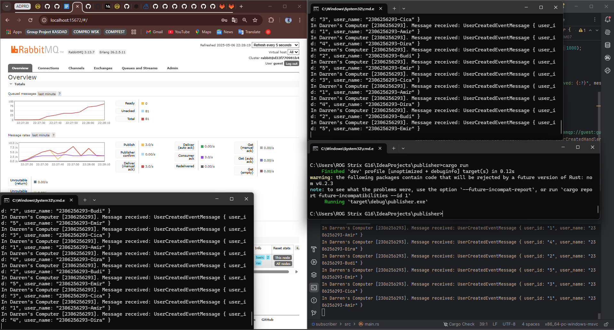
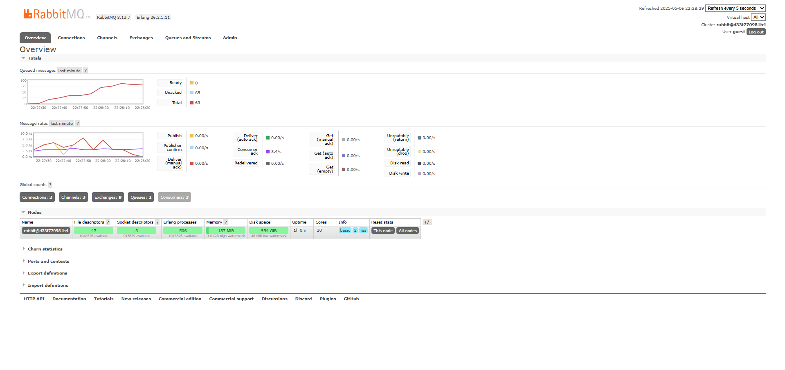

## What is amqp?

**Answer:** AMQP stands for Advanced Message Queuing Protocol. It is a widely-used protocol for messaging between applications, especially in distributed systems. AMQP provides features like reliable message delivery, message queuing, publish/subscribe patterns, and routing. It is commonly used with message brokers like RabbitMQ to enable communication between different components of a system without them needing to know each other's internal logic.

## What does it mean? guest:guest@localhost:5672 , what is the first guest, and what is the second guest, and what is localhost:5672 is for? 

**Answer:** The string `guest:guest@localhost:5672` is a connection string used to connect to an AMQP server, typically RabbitMQ. In this format, the first guest refers to the username, and the second guest refers to the password. These are the default credentials provided by RabbitMQ for local development purposes. The term localhost indicates that the AMQP server is running on the local machine, while 5672 is the default port used by RabbitMQ to accept AMQP protocol connections. So essentially, this string tells the client to connect to a RabbitMQ server on the same machine using the guest user credentials over port 5672.

## Simulation slow subscriber

From the image above, there are 10 queues registered because each time the subscriber runs, it likely creates a new queue, and RabbitMQ retains them unless they're set to auto-delete. The spike in the message delay graph happens because I added a 1-second delay in the subscriber. When multiple messages are sent quickly, they pile up in the queue, causing the delay spike even if the individual processing time is small.

## Reflection and Running at least three subscribers
### Many subscribers

From the images above, we can see that the message queue spike decreases much faster than before. This is because RabbitMQ distributes the messages across multiple active subscribers, allowing them to process messages in parallel. As a result, the queue doesn't build up, and the system becomes more responsive. This demonstrates that an event-driven system can be scaled horizontally by simply adding more consumers.